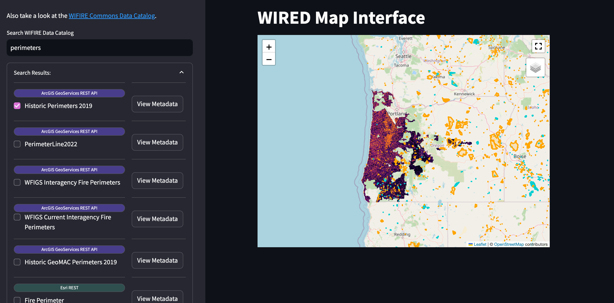

# WIRED Commons Map Interface

  

A web app to find, review, and display geospatial data from the WIFIRE Commons Data Catalog on an interactive map interface.

---

The [WIFIRE Commons Data Catalog](https://wifire-data.sdsc.edu/dataset) is home to a wide collection of wildfire and environmental datasets. It promotes the FAIR data guidelines of findability, accessibility, interoperability, and reusability. However, the interoperability of the datasets it federates has not been widely tested for grid resilience use cases.

  

This app is one of my projects for the 2024 WIRED Grid Resilience Symposium. It demonstrates the interoperability of the WIFIRE Commons Data Catalog by providing an easy map interface for researchers to view spatial data.

Currently, the only supported file types are `Esri REST`, `ArcGIS GeoServices REST API`, `GeoJSON`, `GeoTIFF`, and `TIFF`

Special thanks to Katie O'Laughlin for their guidance as I navigated the development of this project.

  

 <a href="https://wired-commons.streamlit.app/">try it out!</a>
